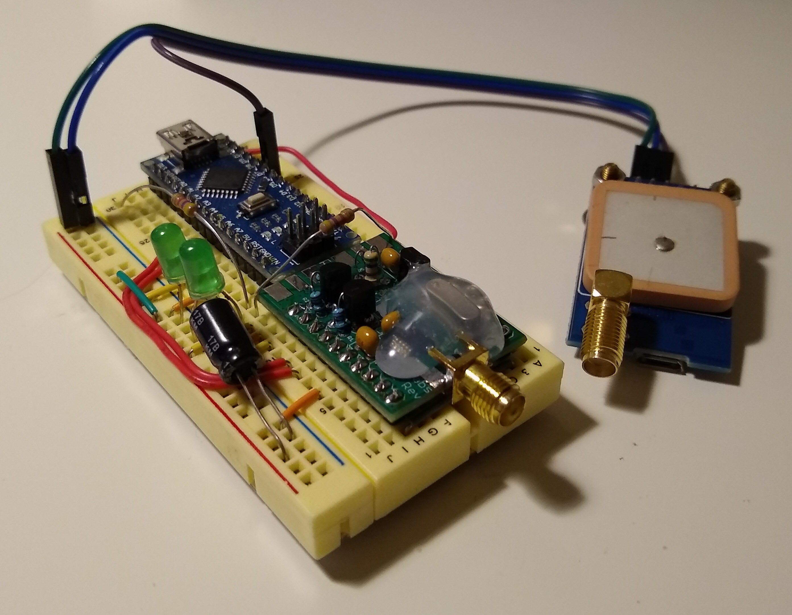

# Herculine I
## a GPS-timed DFCW and FSKCW MEPT beacon

*Image: the beacon hardware and GPS module on a breadboard, not mounted in a project box yet.*

----

## Key points

This is a sketch for a basic, but featureful and highly configurable, manned experimental propagation transmitter or 'MEPT' for the two most popular QRSS modes: dual-frequency CW and frequency-shift-keyed CW. It's usable as-is as a basic QRSS beacon, and should make a good skeleton for building more complex beacon projects with features like sensor data/telemetry. To my knowledge, this is the first Arduino-based DFCW beacon to be published in a web-searchable part of the internet!

VK3EDW's FSKCW MEPT sketch (which itself borrows code from many other hams) was used as a starting point, and much of the code, especially the Morse character encoding, is calqued from it. [His sketch can be seen here.](https://github.com/vk3edw/QRSS-MEPT-VK3EDW/) Many thanks to John for putting his code online!

Key differences include DFCW functionality (of course), omission of LCD-related code (LEDs and the serial console are used instead),  big changes in control flow and GPS logic, a bit of bug-squashing, more and easier configuration, and a heaping helping of comments (wholly for my own benefit).

## Hardware

This sketch is tested and known to work with the following hardware:

 * Arduino Nano
 * NEO7M and QRP Labs QLG2-SE GPS breakouts
 * QRP Labs Si5351A breakout

The relevant pin assignments are marked out clearly in the sketch.

## Dependencies

 * Etherkit Si5351 library
 * TinyGPS++

## Usage

By default, this sketch transmits a beacon message every 10 minutes on 7,039,750 Hz, 1 minute and 30 seconds past every minute ending in zero, alternating between DFCW and FSKCW. All of these parameters can be changed easily, either in configuration variables at the top of the sketch or by making small changes to the relevant functions. Information on frequency selection can be found [here](https://swharden.com/blog/2020-10-03-new-age-of-qrss/). (The end user is responsible for selecting a frequency within the privileges of their amateur radio license. and for compliance with relevant regulations regarding spurious emissions.)

## License

This sketch is presented with no explicit license; much of the code is not mine to license, and VK3EDW's sketch is presented with a "do as you want" license (don't mind if I do!). In the spirit of the '90s, this sketch is postcardware: if you find it useful, feel free to mail a postcard, voided QSL, or a photo of your finished project.

--... ....-    -.. .    -. -. --... -. -...    . .